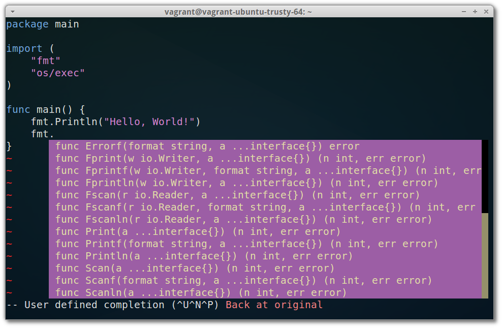

# DevBox-Golong
*Vagrant box backed by Docker or Virtualbox, with Ansible provisioning*

A Vagrant box (Virtualbox or Docker as providers) with Ansible provisioning
for setting up a Vim-based Golang development environment.



## Update: Optional build script of latest Go 1.5 with the new cross-compilation support now included!

As [blogged by Dave Cheney](http://dave.cheney.net/2015/03/03/cross-compilation-just-got-a-whole-lot-better-in-go-1-5), cross-compilation
to different platforms is now (in the latest Go 1.5 development version) as simple as setting two environment variables and
running go build!

To let us laymen test this out easily, we have included an ansible role (aka "build script") for the latest Go 1.5
in this repo. To activate it, just open up the `playbook.yml` file and uncomment the row `- golang-1.5`, and instead comment out
the line saying `- golang`, before running `vagrant up docker` or `vagrant up virtualbox`.

So, instead of looking like this:

```yaml
  roles:
	- { role: dotfiles, sudo: false }
    - { role: golang, sudo: false }
   #- { role: golang-1.5, sudo: false }
    - { role: youcompleteme, sudo: false } # Comment out this to save time!!
```

... it should look like this:

```yaml
  roles:
	- { role: dotfiles, sudo: false }
   #- { role: golang, sudo: false }
    - { role: golang-1.5, sudo: false }
    - { role: youcompleteme, sudo: false } # Comment out this to save time!!
```
Note: Please see the "known issues" below though, about messages about  failed tests, when building!

(You might also consider commenting out the "YouCompleteMe" step to start with, if you want to play around with this quickly)

## Ingredients

- [Ubuntu 14.04 "trusty" LTS 64bit base image](http://www.ubuntu.com/)
- [Go(lang) 1.4.2](http://golan.org/)
- [Vim](https://github.com/Valloric/YouCompleteMe)
- [Fatih's vim-go plugin](https://github.com/fatih/vim-go), providing syntax highlight, gocode integration for autocompletion, and more.
    - See the [vim-go](https://github.com/fatih/vim-go) README for more info on how you can easily enable additional included features.
- [GoCode Go completion engine](https://github.com/nsf/gocode)
- [Valloric's YouCompleteMe](https://github.com/Valloric/YouCompleteMe) for as-you-type completion.
- [Git](http://git-scm.com/)
- [Tig - text mode interface to git](http://jonas.nitro.dk/tig/)
- [gdb - the GNU debugger](http://www.gnu.org/software/gdb)
- [cgdb - Curses based user interface to gdb](https://cgdb.github.io)

## Prerequisites

- [Vagrant](https://www.vagrantup.com/)
- [Ansible](http://www.ansible.com/)
- [VirtualBox](https://www.virtualbox.org/) (Not required if you use Docker as provider!)
- [Docker](https://www.docker.com) (Not required if you use Virtualbox as provider!)

### Installing the requirements in Ubuntu (tested with 14.04)

1. Install Virtualbox:
	```bash
	sudo apt-get install virtualbox
	```

2. Install Docker:
	```bash
	sudo apt-get install docker.io
	```

3. Install a recent version of ansible:
   ```bash
   sudo apt-get install ansible/trusty-backports
   ```

   *(if you ubuntu version is "trusty", otherwise, replace it with your appropriate version)*
4. Install Vagrant, by first downloadng the proper .deb file from [vagrantup.com](https://www.vagrantup.com/downloads.html)

5. ... and then installing it with:
	```bash
	sudo dpkg -i <deb-file>
	```

## Setup and Usage

#### Clone the github repository:

```bash
git clone git@github.com:samuell/devbox-golang
cd devbox-golang
```

#### Bring up the VM

With docker provider (Expect it to take at least ~8m):

```bash
vagrant up docker
```

With VirtualBox provider (Expect it to take at least ~20m):

```bash
vagrant up virtualbox
```

#### Log in to the VM

With docker provider:

```bash
vagrant ssh docker
```

With VirtualBox provider:

```bash
vagrant ssh virtualbox
```

#### Create a repository for uploading to github:

```bash
mkcd ~/code/go/src/github/<user>/<repo>
git init .
```

#### Now, start coding!

```bash
vim main.go
```

#### A tip on how you can upload your existing git ssh keys to the new vm:

With the following command you can get the info you need to run scp
against the machine:

```bash
vagrant ssh-config [docker | virtualbox]
```

Note the hostname and port number (and identity file, if you with),
and run, for example:

```bash
scp -i <identity-file-path> -P <portno> \
	~/.ssh/id_rsa_<whateveryounamedit> \
	vagrant@<hostname>:/home/vagrant/.ssh/
```

Then, sometimes, in order to get the new key activated in your shell
after logging in to the vm, you might need to do:

```bash
ssh-agent bash -l
ssh-add ~/.ssh/id_rsa_<whateveryounamedit>
```

- Autocompletion will happen automatically
- If you have turned off the YouCompleteMe role, you will get autocompletion with `<C-x><C-o>`

## Known issues

- GDB Breakpoints don't take, unless you follow the advice given [here](https://github.com/docker/docker/issues/7276#issuecomment-50436671).
  That is, in short, do this on your **Host machine**, if you run Ubuntu:

  ```bash
  sudo apt-get install apparmor-utils
  sudo echo 'aa-complain /etc/apparmor.d/docker' >> /etc/rc.local
  sudo aa-complain /etc/apparmor.d/docker
  ```

  The problem seems to be that `ptrace` is not given access to the process otherwise.
- There are some really red message from the docker daemon when running `vagrant halt`.
  Everything seems to work as expected though (including the shutdown)
- There are some red message on vagrant up, but they are nothing serious, and can be ignored for now.
- When building Go 1.5 dev, the build will end with a lot of error messages, but that is from the
  tests after the build. The build itself seems to work, largely.

## References

- [Vagrant & Ansible Quickstart Tutorial](http://adamcod.es/2014/09/23/vagrant-ansible-quickstart-tutorial.html)
